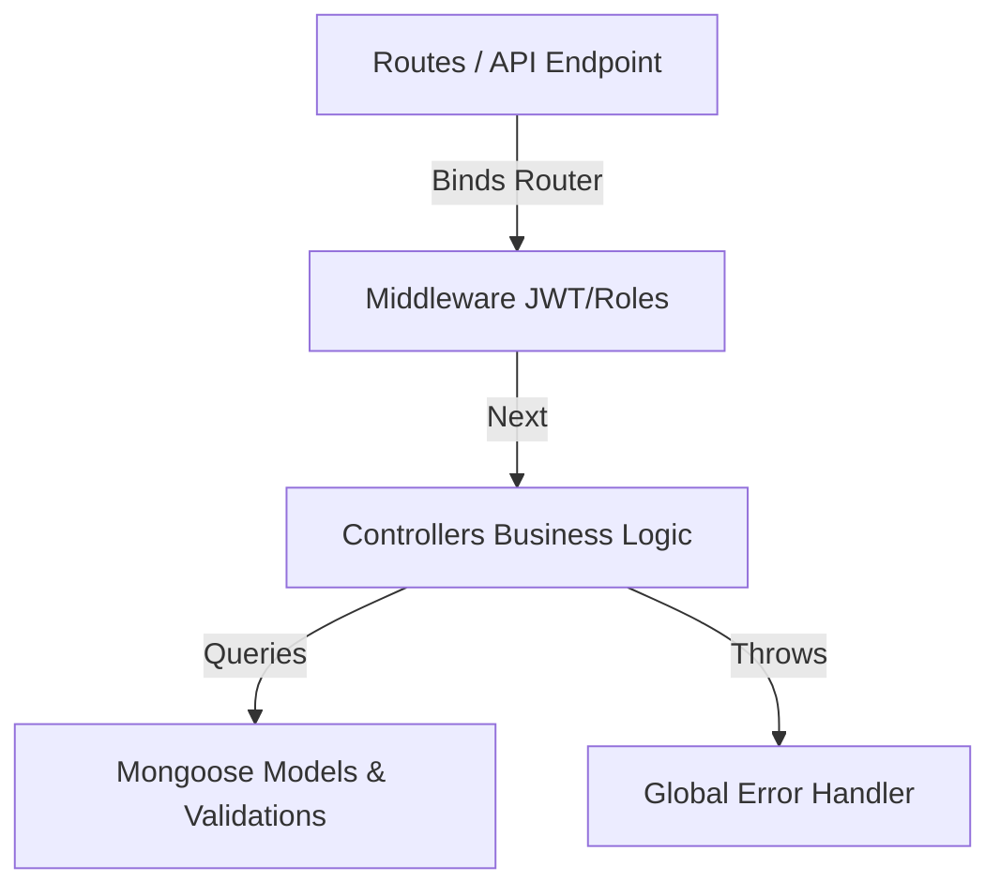
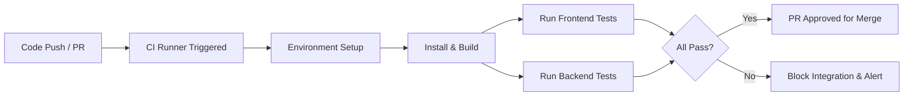

# CampusConnect — Backend Testing & CI/CD Strategy Document

This document outlines the backend unit testing strategy and automated Continuous Integration (CI) configuration for the **CampusConnect** Node.js/Express API.

---

## TODO 5: Identify Testable Backend Components

A modular, testable backend structure isolates logic from HTTP network details. Below is the identification of components suitable for unit and integration testing.

1. **Authentication Logic (`controllers/authController.js`)**:
   - Manages user login, registration, password hashing verification, and token signing.
   - Test target: Brypt comparison calls, JWT signing payloads, email lowercasing, and duplicate record checks.

2. **User APIs (`controllers/userController.js`)**:
   - Manages user listings, profiles retrieval, and user account deletions.
   - Test target: Password exclusions (`-password`), role boundary enforcements (e.g., student vs. admin access limits).

3. **Task APIs (`controllers/taskController.js`)**:
   - Manages CRUD lifecycle of tasks.
   - Test target: Filtering parameter logic (`req.query.userId`), object populate bindings (`assignedUser`), and data modifier hooks.

4. **Middleware Logic (`middleware/auth.js` & `middleware/authorize.js`)**:
   - Verifies JWT headers and authorizes role clearances.
   - Test target: Verification failures, missing bearer tokens, and invalid roles blockages.

5. **Validation Functions (Mongoose Models: `User.js` & `Task.js`)**:
   - Encapsulates domain rules (email regex matches, minimum passwords/titles lengths).
   - Test target: Invalid fields trigger validator rejections.

---

## TODO 6: Design API Unit Test Cases

Below is the test scenario specification matrix for the RESTful endpoints.

### 1. Authentication APIs (`/api/auth`)

| Scenario ID | Target Endpoint | Scenario Description | Input / Action Payload | Expected Outcome / Assertions |
| :--- | :--- | :--- | :--- | :--- |
| **TC-B-AUTH-01** | `POST /register` | Successful registration | Valid `{ name, email, password }` | Status: `201` - `success: true` - `token` present - Password hash **not** leaked |
| **TC-B-AUTH-02** | `POST /register` | Duplicate registration | Attempt to register existing email | Status: `409` - `success: false` - Message: "Email already registered." |
| **TC-B-AUTH-03** | `POST /login` | Successful login | Valid `{ email, password }` | Status: `200` - `success: true` - Returns valid JWT and user meta |
| **TC-B-AUTH-04** | `POST /login` | Invalid credentials | Correct email but wrong password | Status: `401` - `success: false` - Message: "Invalid email or password." |

### 2. Task APIs (`/api/tasks`)

| Scenario ID | Target Endpoint | Scenario Description | Input / Action Payload | Expected Outcome / Assertions |
| :--- | :--- | :--- | :--- | :--- |
| **TC-B-TASK-01** | `POST /` | Create task success | Header Token + `{ title, description }` | Status: `201` - Task document created in DB - Assigned to calling user |
| **TC-B-TASK-02** | `GET /` | Fetch tasks list | Header Token | Status: `200` - Returns array of tasks matching schema |
| **TC-B-TASK-03** | `PUT /:id` | Update task success | Header Token + `{ status: "completed" }` | Status: `200` - Status updated in DB - Returns modified task |
| **TC-B-TASK-04** | `DELETE /:id` | Delete task success | Header Token + target task ID | Status: `200` - Task removed from DB |
| **TC-B-TASK-05** | `POST /` | Missing required fields | Header Token + `{ description: "No title" }` | Status: `400` - `success: false` - Message contains: "Task title is required." |

---

## TODO 7: Test Middleware Logic

Our middlewares act as quality gates before controllers process requests. Tests should verify that the routing chain is halted or passed as expected.

### 1. Token Verification Scenarios (JWT protect)
- **Valid Token Pass**: Mock `jwt.verify` to resolve successfully. Validate that `req.user` is populated with the decoded token payload and `next()` is called without arguments.
- **Missing Token Block**: Send request without the `Authorization` header or with a malformed prefix (not `Bearer `). Assert that `next()` is called with a `401 AppError` ("Access denied. No token provided.").
- **Invalid Token Block**: Send request with `Bearer invalid.jwt.string`. Assert that `next(err)` receives a token verification error (`JsonWebTokenError`), returning `401`.

### 2. Role-Based Authorization Scenarios (authorize)
- **Role Match Pass**: Call `authorize('admin')` with a request user payload containing `{ role: 'admin' }`. Assert that the middleware executes `next()` with no errors.
- **Role Mismatch Block**: Call `authorize('admin')` with a request user payload containing `{ role: 'student' }`. Assert that `next()` is called with a `403 AppError` ("Access denied. Role 'student' is not authorized...").

---

## TODO 8: Validate Backend Error Handling

The Express API uses a centralized global error handler middleware (`middleware/errorHandler.js`) that must handle both standard library errors and unexpected crashes uniformly.

### Error Case Validations

1. **Invalid Routes**:
   - Request non-existent endpoints (e.g., `GET /api/nonexistent`).
   - Expected: Status `404` with `{ success: false, message: "Route not found." }`.

2. **Database Failures (Simulated)**:
   - Mock MongoDB/Mongoose connection to throw a connection timeout or read error during a controller call.
   - Expected: The controller catches the error, calls `next(err)`, and the global handler logs the incident and returns status `500` with `{ success: false, message: "An unexpected error occurred." }` to avoid leaking database internals.

3. **Missing Request Body Data**:
   - Request registration `POST /api/auth/register` with missing email or password.
   - Expected: Status `400` with `{ success: false, message: "All fields are required." }`.

4. **Invalid Data Formats**:
   - Request profile update `PUT /api/users/:id` with password less than 8 characters.
   - Expected: Mongoose validation intercepts with `ValidationError`, mapping to status `400` with `{ success: false, message: "Password must be at least 8 characters." }`.

---

## TODO 9: Introduce CI Concept (Basic Level)

**Continuous Integration (CI)** is a software development practice where developers merge their code changes into a central repository frequently (usually multiple times a day). Every merge triggers an automated build and test pipeline to detect integration errors as early as possible.

### Core Value Pillars

- **Automated Testing on Push**: Eliminates the "works on my machine" phenomenon. All tests execute in a clean virtual environment (runner) matching production.
- **Ensuring Code Quality Before Merging**: Protects the `main` branch from regressions, compilation failures, or syntax flaws.
- **Reducing Manual Testing Effort**: Automates sanity checks and security scans, allowing QA to focus on complex, exploratory test tasks.

---

## TODO 10: Design GitHub Actions Workflow

Below is the design of our automated pipeline defined in `.github/workflows/ci.yml`.

### Step-by-Step Execution Diagram

1. **Trigger Check**: Listens for any code `push` or `pull_request` targeting the `main` branch.
2. **Environment Boot**: Spins up an `ubuntu-latest` container running Node.js 18.
3. **Service Provision**: Provisions an isolated MongoDB instance in a parallel Docker container on port `27017` to enable database integration tests.
4. **Cache & Restore**: Restores npm dependencies from the cache if the lockfiles have not changed, maximizing build speed.
5. **Dependency Installation**: Runs `npm ci` in both `client/` and `server/` directories.
6. **Backend Verification**: Starts the Express server in the background and runs the 29-assertion integration test suite.
7. **Frontend Verification**: Builds the React production bundle to ensure no compile errors are introduced.
