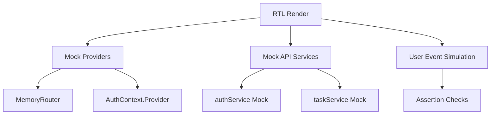

# CampusConnect — Frontend Unit Testing Strategy & Design Document

This document outlines the frontend unit testing strategy and test scenarios for the **CampusConnect** React application. It establishes a standardized framework for component isolation, behavior verification, and automated regression testing.

---

## TODO 1: Identify Testable Frontend Components

Below is the mapping of CampusConnect's key frontend components and their testability scope.

| Component Name | File Path | Primary Responsibilities | Testability Assessment & Key Test Subjects |
| :--- | :--- | :--- | :--- |
| **Login** | `client/src/pages/Login.jsx` | Authenticates users. Renders forms, takes inputs, binds events, fires API logins, updates `AuthContext` status, and handles routing. | **High Priority**. Forms, form submissions, client-side validation checks, and auth failure alerts. |
| **Register** | `client/src/pages/Register.jsx` | Registers students. Collects name, email, password; binds actions, handles submit, defaults to "student" role, and routes to dashboard on success. | **High Priority**. Account creation validation (password length, email format), service mocking, and error message rendering. |
| **Dashboard** | `client/src/pages/Dashboard.jsx` | Hub for announcements and stats. Renders recent tasks, filters announcements, handles user data upgrades, and displays counts. | **Medium Priority**. Correct display of state counts, conditional announcements filter, and profile settings modal toggle. |
| **Tasks** | `client/src/pages/Tasks.jsx` | Core CRUD operations board. Displays lists of tasks, handles edits, status updates (Pending, In Progress, Completed), creation, and deletion. | **High Priority**. Filter toggles, task creation form submits, deletion trigger confirmations, and mock task list arrays. |
| **InputField** | `client/src/components/InputField.jsx` | Reusable input container. Handles types, icons, custom placeholders, label binding, and validation error messages. | **High Priority (Unit)**. Error message visibility, input binding (onChange), type reflection, and custom classes. |
| **Button** | `client/src/components/Button.jsx` | Reusable UI button. Handles styles (primary, secondary, danger), spinner/loading state, icons, and clicks. | **High Priority (Unit)**. Spinner visible when `loading` is true, disabled states, click handler callbacks. |
| **Navbar** | `client/src/components/Navbar.jsx` | Global header. Houses logo, user name, role badge, navigation links, and logout controls. | **Medium Priority**. Renders active paths, displays logged-in user name, triggers logout function on click. |
| **Card** | `client/src/components/Card.jsx` | Generic data container wrapper. Used to display announcements or list task summaries. | **Low Priority**. Proper rendering of children, title headers, and custom layout styling classes. |

---

## TODO 2: Design Frontend Test Scenarios

### 1. Authentication UI (Login & Register Pages)

| Scenario ID | Target Page | Test Case Description | Inputs / Actions | Expected Outcome |
| :--- | :--- | :--- | :--- | :--- |
| **TC-AUTH-01** | `Login` | Form rendering verification | Mount page | Renders header, email field, password field, and "Sign In" button. |
| **TC-AUTH-02** | `Login` | Active data binding | Type in email & password | Values update in form inputs instantly. |
| **TC-AUTH-03** | `Login` | Successful authentication | Valid email & password, click submit | Triggers API call, receives token, saves to localStorage, updates AuthContext, routes to `/dashboard`. |
| **TC-AUTH-04** | `Register`| Input form validation | Short password (< 8 chars), invalid email | Display warning: "Password must be at least 8 characters" and "Please enter a valid email address". |
| **TC-AUTH-05** | `Register`| Default student registration | Valid details, submit form | Register request carries `{ role: "student" }`, routes user to dashboard. |

### 2. Dashboard UI (Dashboard Page)

| Scenario ID | Target Page | Test Case Description | Inputs / Actions | Expected Outcome |
| :--- | :--- | :--- | :--- | :--- |
| **TC-DASH-01** | `Dashboard` | Loading State Display | Mount page (API request pending) | Shows loading spinners; layout skeletons are visible. |
| **TC-DASH-02** | `Dashboard` | Empty State Handling | Mount page (Zero tasks/announcements) | Renders: "No tasks assigned" and "No announcements today". |
| **TC-DASH-03** | `Dashboard` | Data Populate & Stats | API resolves with 3 tasks | Stats dashboard displays counts correctly (e.g., Tasks: 3). |
| **TC-DASH-04** | `Dashboard` | Announcement Filter | Change filter category select | Displays only announcements matching the selected category. |

### 3. Component Behavior (Props & Rendering)

| Scenario ID | Target Component | Test Case Description | Inputs / Actions | Expected Outcome |
| :--- | :--- | :--- | :--- | :--- |
| **TC-COMP-01** | `InputField` | Input Error Props | Pass `error="Invalid email"` | Renders error text, borders turn red. |
| **TC-COMP-02** | `Button` | Loading State Blocks Click | Pass `loading={true}`, click button | Spinner is displayed, button is disabled, click handler does not execute. |
| **TC-COMP-03** | `Navbar` | Navigation Access Restriction | Render with `user=null` (guest) | Hides dashboard, tasks, and logout buttons. Displays only Home link. |
| **TC-COMP-04** | `Card` | Child Wrapper Render | Pass `<p>Test Child</p>` as child | Text "Test Child" renders inside the Card's DOM node. |

---

## TODO 3: Implement Unit Testing Strategy for React

To test UI behavior reliably without spawning databases or network layers, the project will implement a test suite utilizing **Vitest** (test runner) and **React Testing Library (RTL)** (rendering & queries).



### Key Pillars of the Strategy

1. **Component Isolation via Mocking**:
   - Outward API layer files (`client/src/services/*`) and requests must be mocked globally using Vitest mocks (`vi.mock`).
   - Hooks that depend on active router stacks (like `useNavigate` from `react-router-dom`) are mocked to track redirect attempts without hitting browser APIs.

2. **Mocking Global Contexts**:
   - Wrap components requiring authentication parameters in a test wrapper containing custom providers:
     ```jsx
     const renderWithProviders = (ui, { user = null } = {}) => {
       return render(
         <AuthContext.Provider value={{ user, login: vi.fn(), logout: vi.fn() }}>
           <MemoryRouter>{ui}</MemoryRouter>
         </AuthContext.Provider>
       );
     };
     ```

3. **Verifying Behavior over Implementation**:
   - Select DOM elements using user-facing queries (`getByRole`, `getByLabelText`, `getByPlaceholderText`) rather than targeting class names or implementation IDs.
   - Simulate genuine input actions using `@testing-library/user-event` to trigger change listeners.

### Blueprint Example: Testing the `Login.jsx` Component

```javascript
import { render, screen, waitFor } from '@testing-library/react';
import userEvent from '@testing-library/user-event';
import { vi } from 'vitest';
import { MemoryRouter } from 'react-router-dom';
import AuthContext from '../context/AuthContext';
import Login from './Login';
import { authService } from '../services/authService';

// Mock the Auth API service
vi.mock('../services/authService', () => ({
  authService: {
    login: vi.fn(),
  },
}));

const mockNavigate = vi.fn();
vi.mock('react-router-dom', async () => {
  const actual = await vi.importActual('react-router-dom');
  return {
    ...actual,
    useNavigate: () => mockNavigate,
  };
});

describe('Login Component Unit Tests', () => {
  const mockLoginContext = vi.fn();

  beforeEach(() => {
    vi.clearAllMocks();
  });

  test('successfully signs in with valid credentials', async () => {
    authService.login.mockResolvedValue({
      user: { id: '1', name: 'Test Student', role: 'student' },
      token: 'mock-jwt-token',
    });

    render(
      <AuthContext.Provider value={{ user: null, login: mockLoginContext }}>
        <MemoryRouter>
          <Login />
        </MemoryRouter>
      </AuthContext.Provider>
    );

    // Act - fill in the login form
    await userEvent.type(screen.getByLabelText(/email/i), 'student@campus.edu');
    await userEvent.type(screen.getByLabelText(/password/i), 'password123');
    await userEvent.click(screen.getByRole('button', { name: /sign in/i }));

    // Assert API integration calls
    expect(authService.login).toHaveBeenCalledWith({
      email: 'student@campus.edu',
      password: 'password123',
    });

    // Assert Context update and routing trigger
    await waitFor(() => {
      expect(mockLoginContext).toHaveBeenCalledWith(
        { id: '1', name: 'Test Student', role: 'student' },
        'mock-jwt-token'
      );
      expect(mockNavigate).toHaveBeenCalledWith('/dashboard');
    });
  });
});
```

---

## TODO 4: Validate Frontend Error Scenarios

The testing system must guarantee that error conditions are handled gracefully and clear recovery paths are presented to the user.

### Error Handling Specification Matrix

| Error Scenario | Component | Simulated Action / API Mock | Expected UI Behavior & Assertions |
| :--- | :--- | :--- | :--- |
| **Empty Submission** | `Login` / `Register` | Trigger submit button click without entering values. | - Intercept form submit.<br>- Display: "All fields are required" or specific validation errors.<br>- Submit service calls are **not** triggered. |
| **Invalid Format Validation** | `Register` | Type email `invalid-email` and submit. | - Display inline error: "Please enter a valid email address".<br>- Validation style classes (e.g. red borders) apply.<br>- Submit action blocked. |
| **API Rejection (Bad Credentials)** | `Login` | Mock `authService.login` rejection with code `401` ("Invalid email or password"). | - Renders alert card containing the backend error message.<br>- Form inputs remain intact for typing corrections.<br>- Spinner resets to standard button text. |
| **Network Timeout / Server Down** | `Dashboard` | Mock `taskService.getAll` rejection with code `500` ("Failed to load tasks"). | - Count displays fallback indicator/zero value.<br>- Display alert banner: "Failed to connect to the server. Please try again." |
| **Page Loading Delay** | `Tasks` | Mock delay on `taskService.getAll` promise resolution. | - Create new task button is disabled.<br>- Loading indicator or skeleton cards are displayed.<br>- Tasks board remains empty until promise resolves. |
